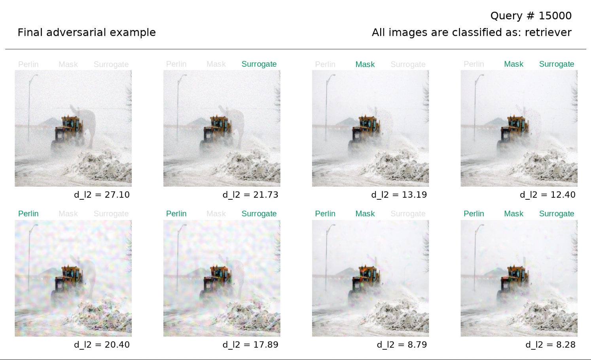

# Biased Boundary Attack: ImageNet implementation

This repository contains an implementation of the Boundary Attack on ImageNet, which is accelerated by various priors (Perlin/low frequency, regional masking, surrogate gradients).
- Paper on arXiv: [**Guessing Smart: Biased Sampling for Efficient Black-box Adversarial Attacks**](https://arxiv.org/abs/1812.09803)
- Our winning submission to the NeurIPS 2018 Adversarial Vision Challenge was based on this work: https://github.com/ttbrunner/biased_boundary_attack_avc
- Click the image below for an animated demonstration!

https://www.youtube.com/watch?v=ljUmA66Gr0A&list=PL4qRc8jGTvrCpjKSmnKXRCHmsIrMKktX2

## Usage:
- Download model checkpoints to models/, or use your own models
- Enable or disable biases in bench_settings.py
- Set path to ImageNet in run_imagenet_bench.py
- Start run_imagenet_bench.py
- Images are logged to "./out_imagenet_bench/".

 

